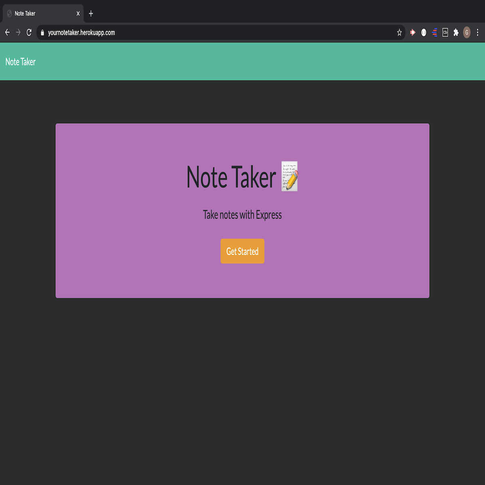
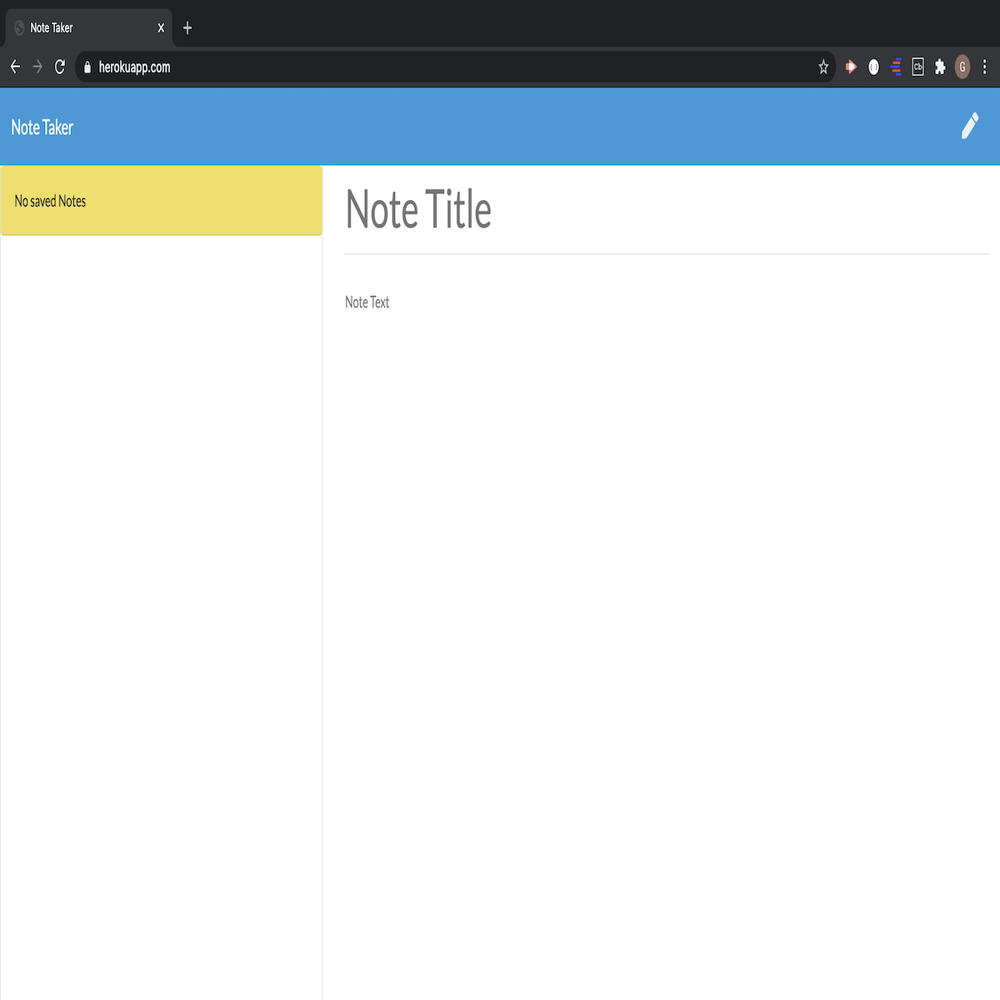

# ~ Note Taker App ~

# Usage:
This App was designed using HTML, CSS, Javascript, Node.js and Express.js. I deployed this application on GitHub and Heroku.

As a user, this application will allow the user to write notes and save the notes. When the user click the "GET STARTED" button, the app will redirect the user to a page where the user can input the title of the note the user will add. Once the title of the note is written, the user can input the text of the note. After completing the text, the user will be given an option to save his/her note. The user's saved notes will be displayed on the left side of the page.
  
The user can add however many notes he/she wants. When the user saves his/her notes and then refreshes the page or leaves the browser, then returns to the note-taker app, the user's saved notes will still be visible/available. The user will have the ability to delete any of his/her notes the user chooses. This app can also be used as a way for the user to keep track of his/her daily activities, if they choose to.
 

# Links: 
Github Link: https://github.com/Guled06/note-taker
  
Heroku Link: https://yournotetaker.herokuapp.com/
 

# Screenshots Of Deployed App

  
